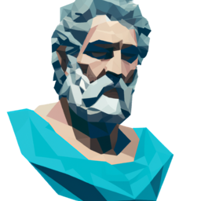
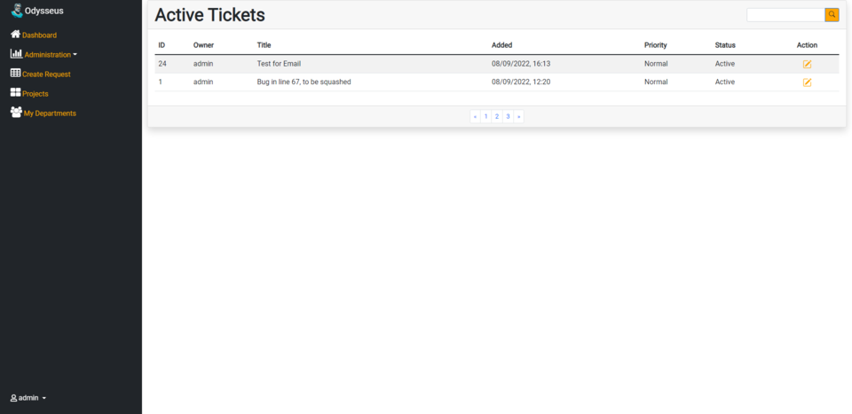
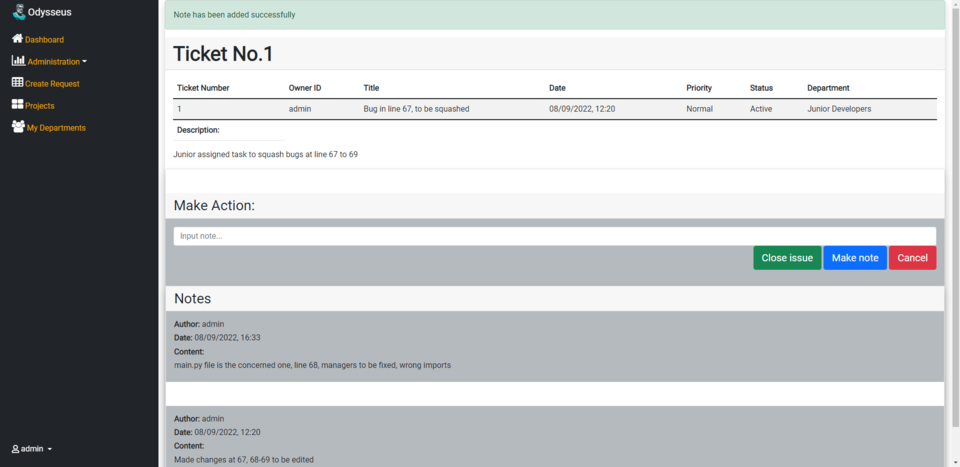
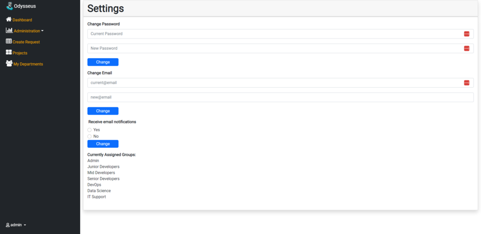
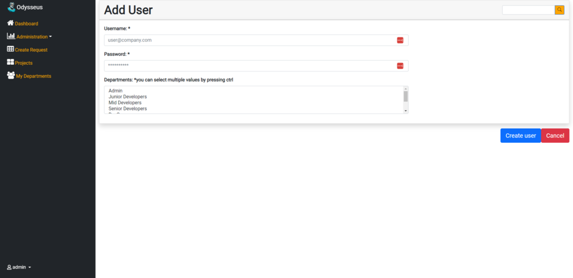
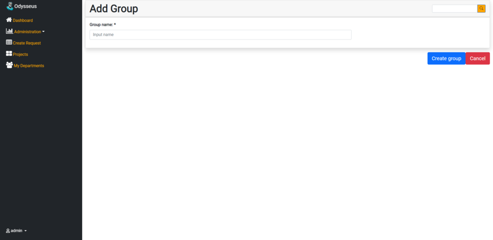
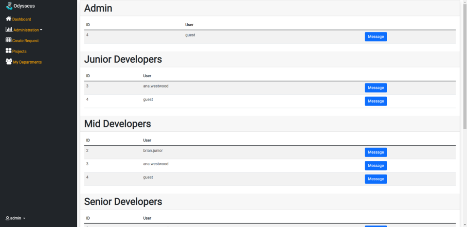

# Odysseus

# What is it?
## A ticketing system written using:
1. []
2. []
3. [-blue?style=for-the-badge)]
4. []

# How can I access it?
## A deployed version for production is [here](https://odysseus-app.azurewebsites.net/)

### **Functions**
1. Create Tickets
2. Create Groups
3. Notifications for any recently created tickets
4. Add notes in tickets
5. Assign tickets to groups
6. Close tickets
7. Change email or password
8. Set notifications for your email

# Screenshot showcase

## Login

## User Dashboard

## Ticket Overview

## User Settings

## Add User 

## Add Group

## Departments
