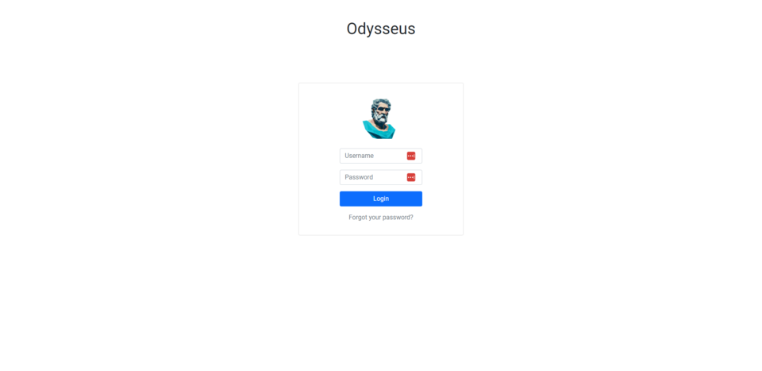

# Odysseus

# What is it?
### A ticketing system written in Python, using Flask, SQLAlchemy (SQLite) and BCrypt

### **Functions**
1. Create Tickets
2. Create Groups
3. Notifications for any recently created tickets
4. Add notes in tickets
5. Assign tickets to groups
6. Close tickets
7. Change email or password
8. Set notifications for your email

# Screenshot showcase

## Login

## User Dashboard

## Ticket Overview

## User Settings

## Add User 

## Add Group

## Departments
